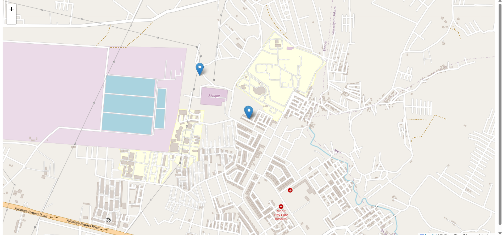
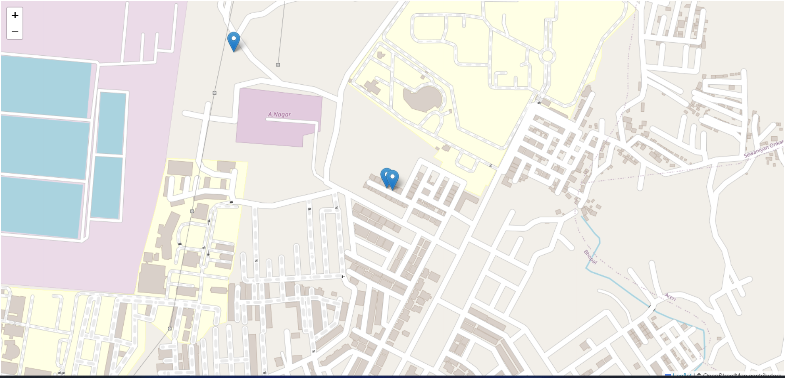

📍 Live Tracker Application
Real-Time Location Tracking Web App
Built with Node.js, Express.js, Socket.io, and Leaflet.js

🚀 Live Demo: live-tracker-application.onrender.com

🧭 Overview
The Live Tracker Application is a real-time location tracking web application that allows users to share and monitor live locations on an interactive map. It leverages the browser's Geolocation API and real-time communication via WebSockets to provide instantaneous location updates.

🔧 Features
Real-Time Location Sharing: Users can share their current location in real-time.

Interactive Map: Displays user locations on a dynamic map using Leaflet.js.

WebSocket Communication: Utilizes Socket.io for efficient real-time data transfer.

Responsive Design: Ensures usability across various devices and screen sizes.

🛠️ Technologies Used
Frontend:

HTML5

CSS3

JavaScript

Leaflet.js

Backend:

Node.js

Express.js

Socket.io

Deployment:

Render.com

📂 Project Structure
php
Copy
Edit
Live-Tracker-Application/
├── public/             # Static assets (CSS, JS)
├── views/              # EJS templates
├── app.js              # Main server file
├── package.json        # Project metadata and dependencies
└── README.md           # Project documentation
🚀 Getting Started
Prerequisites
Node.js installed on your machine.

Installation
Clone the repository:

bash
Copy
Edit
git clone https://github.com/PriyanshuAcharya41/Live-Tracker-Application.git
cd Live-Tracker-Application
Install dependencies:

bash
Copy
Edit
npm install
Start the server:

bash
Copy
Edit
node app.js
Access the application:

Open your browser and navigate to http://localhost:3000.

🌐 Deployment
The application is deployed on Render, a cloud platform for hosting web applications.

Live URL: https://live-tracker-application.onrender.com/

📸 Screenshots

Interactive map displaying real-time user locations.

Responsive design ensures usability on mobile devices.

🤝 Contributing
Contributions are welcome! Please fork the repository and submit a pull request for any enhancements or bug fixes.

📄 License
This project is licensed under the MIT License.

📬 Contact
Priyanshu Acharya
Email: priyanshuacharyaofficial@gmail.com
GitHub: PriyanshuAcharya41
